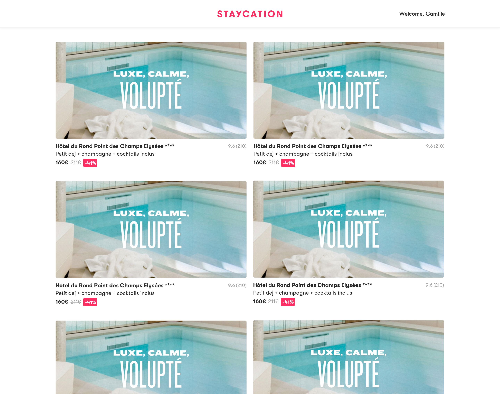

## Julien Catonnet challenge solution

Answer for (no code) How would you implement a caching strategy for this app?:
- We would leverage React Query caching mechanism using staleTime to optimize data fetching. (RQ will serve cached data without refetching for a given time)
- Coupled with query Invalidation to ensure that cached data remains consistent with the server by invalidating and refetching data when necessary 
- We could also implement prefetchQuery to fetch data in advance, before a user clicks on a Hotel card for example
- if the app is going to grow we could implement a better state/caching strategy in the backend using Redis. We would use the in-memory functionality to store data for better retrieval and avoid to query the databse repeatedly

Project Overview
The Staycation Homepage Clone aims to replicate the core functionalities of Staycation's package wall, allowing users to browse through various hotel packages. Each package card displays vital information such as the hotel's name, star rating, preview text, image, aggregated reviews, pricing details, and availability status.

Features
Data Fetching with React Query: Efficient data fetching and caching mechanisms to ensure optimal performance.
Modular Component Design: Small, reusable components combined into smart parent components for maintainability.
Dynamic Ordering: Packages are displayed based on availability, lowest price, and descending reviews.
Responsive Design: Ensures the application is accessible and visually appealing on various screen sizes.
Error Handling: Graceful handling of loading states and potential errors during data fetching.
Comprehensive Testing: Utilizing React Testing Library to ensure component reliability and correctness.
Technologies Used
Frontend:
React
React Query (@tanstack/react-query)
React Testing Library
SCSS for styling
Backend:
PostgreSQL
Node.js (assuming based on context, adjust if different)
Other Tools:
Docker for containerization
Jest for testing
MSW (Mock Service Worker) for API mocking in tests

Design Decisions
Backend: Single Comprehensive Query
Choice:
We opted to use a single comprehensive SQL query to fetch all necessary hotel data, including availability, pricing, and aggregated reviews. This approach ensures that all relevant information is retrieved in one database call, simplifying data management on the frontend.

Reasons:
Simplicity: Reduces the complexity of making multiple API calls from the frontend.
Performance: Minimizes the number of database interactions, which can be more efficient especially with well-optimized queries.
Data Consistency: Ensures that all related data is fetched simultaneously, preventing inconsistencies that might arise from separate queries.
Real-World Consideration:
In larger applications with more complex data relationships and higher scalability requirements, it would be prudent to split queries into reusable segments. This modular approach allows for better maintainability, caching strategies, and can improve performance by fetching only the necessary data when needed.

Frontend: Modular Component Architecture
Choice:
The frontend is built using a modular architecture where small, reusable components (HotelImage, HotelInfo, HotelReviews, HotelPricing) are combined into a smart parent component (HotelCard). This design promotes reusability and separation of concerns.

Reasons:
Maintainability: Smaller components are easier to manage, update, and debug.
Reusability: Components like HotelInfo and HotelReviews can be reused across different parts of the application or in other projects.
Clarity: A clear separation between presentational and container components enhances code readability and organization.
Data Ordering Strategy
Choice:
Hotel packages are ordered based on:

Availability: Available packages are prioritized.
Lowest Price: Within the available packages, those with the lowest discount prices are displayed first.
Descending Reviews: Among packages with the same availability and price, those with higher average review scores are shown first.
Reasons:
User Experience: Users are more likely to be interested in available packages, especially those offering the best prices.
Value Highlighting: Displaying higher-reviewed packages first builds trust and showcases quality.
Logical Flow: This ordering ensures that users see the most relevant and valuable options upfront.
Performance Optimizations
1. React.memo
Usage: Applied to the HotelCard component and potentially to its child components (HotelInfo, HotelReviews, etc.) to prevent unnecessary re-renders when props remain unchanged.
Benefit: Enhances rendering performance, especially when dealing with large lists of hotel packages.
2. Lazy Loading with React.lazy and Suspense
Usage: Implemented lazy loading for the HotelCard component within the HotelList component to split code and reduce the initial bundle size.
Benefit: Improves initial load times by loading heavy components only when needed.
3. Efficient Styling
Approach: Utilized SCSS for modular and maintainable styling, avoiding inline styles to leverage CSS optimizations and prevent unnecessary recalculations.

Future Improvements
While the current implementation meets the project requirements, there are several areas for potential enhancement:

Enhanced Error Handling

Implement more granular error messages based on different error types.
Add retry mechanisms for failed API calls.
Pagination or Infinite Scrolling

Introduce pagination or infinite scrolling for better performance with large datasets.
Virtualization of Hotel List

Integrate virtualization libraries (react-window or react-virtualized) to efficiently render extensive hotel lists.
Routing and Navigation

Implement React Router for navigating between different pages or detailed views of hotels.
User Authentication

Add user authentication to handle bookings and user-specific data.
Booking Functionality

Develop booking features allowing users to reserve hotel packages.
Accessibility Enhancements

Ensure the application meets accessibility standards (ARIA roles, keyboard navigation, etc.).
SEO Optimization

Optimize the application for search engines to improve visibility.
Unit and Integration Tests

Expand the test suite to cover more components and integration flows.
Backend Query Optimization

Monitor and optimize the SQL query performance as the dataset grows.
Consider splitting queries for better maintainability and scalability in a larger application context.


# Staycation's Technical Test

Welcome! This technical test aims to validate a few basic programming skills before we go further.

The goal is to reproduce a light version of Staycation's homepage package wall.
Some of the questions are independant, some others are sequentially dependant.

Remember that the goal is not necessarily to answer all the questions, but to go far enough to show the range of your talents ;)
Improvisation is welcome, as long as it demonstrates your ability to build great apps with us!

## Launch the apps
Before starting, check that you can run the following apps:

- The PostgreSQL database using `docker-compose up -V`
- The front app using `cd front; yarn start`
- The backend of your choice in the `back` folder, referring to its launch instruction

## Coding guidelines

### Do whatever you want with the code! 💪️
The code you just pulled is a minimal working frontend/backend app needed to answer the questions.
This is not required, but you can install any additional package you want and do whatever you want
with the code to show us your skills, as long as you answer the questions 😉️

### Styling
A few key points to help you through styling:
1. App must be browsable on any decent-size desktop screen
2. Paddings, margins & border radiuses have discrete values: 4px, 8px or any other multiple of 8
3. Color set is located [here](front/src/styles/colors.scss)


## Ready? GO! 🏁️

1. Fetch hotels so it matches the hotel model described below
2. Display hotel cards as shown in the figure below
3. Top bar should be static while scrolling. Implement it
4. We want the Staycation logo to be centered in the top bar, as shown in the figure below. Implement it.
5. Display the aggregated review count & score for each package card
6. Display the last availability on every package price. See availability definition below
7. Take bookings into account to compute remaining stock
8. If a package is not available on the current sale date, fetch its lowest opening price on the most recent sale date it has availabilites on (careful, it's a windowed lookup ;)). Display these availabilities in grey on the package card.
9. (no code) How would you implement a caching strategy for this app?

### Appendix

#### Expected hotel model
```json
{
    "id": 1,
    "name": "Molitor",
    "stars": 5,
    "preview": "Petit dej + piscine + ...",
    "pictureId": "",
    
}
```

#### Hotel card


#### Final expected result


#### Availability definition
- An hotel availabilities are defined by its rooms openings (easy)
- The table `openings` has 6 interesting columns: `room_id` (malin), `sale_id`, `date`, `stock`, `price` and `discount_price`
- An hotel is bookable on a given day only if there is at least an opening for one of its room on this date and with a stock > 0
- The lowest availability on a sale period for an hotel is the available opening with the lowest `discount_price` on this given `sale_id`
- The last `sale_id` for this test is (obviously) the `sale_dates` row where the date is the latest (`id 90` in our test data)
